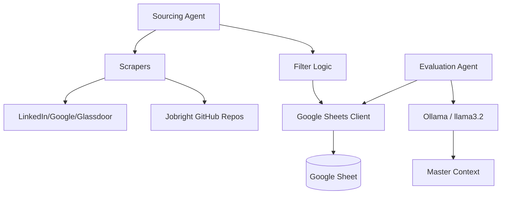

# Job Automation Pipeline

An automated system for sourcing, filtering, and evaluating job postings using local LLMs (Ollama) and Google Sheets.

## Architecture


## Project Structure
- `src/core/`: Shared clients (Sheets, LLM).
- `src/scrapers/`: Individual job site scrapers.
- `src/agents/`: Business logic (Sourcing, Evaluation).
- `src/prompts/`: LLM System Prompts.
- `config/`: Credentials and local configuration.
- `.agent/workflows/`: Automation steps for AI agents.

## Usage
Run the full pipeline:
```bash
python3 run_pipeline.py
```
For detailed agent instructions, see [.agent/workflows/job_pipeline.md](.agent/workflows/job_pipeline.md).

## Configuration
- **Google Sheets**: Place `config/credentials.json` (service account key) for the Sheets API.
- **Environment**: Copy `.env.example` to `.env`. Optional: `OLLAMA_HOST`, `PROFILE_DIR` or `MASTER_PROFILE_PATH`, `PIPELINE_CONFIG`, `GEMINI_API_KEY` (for sponsorship agent).
- **Pipeline**: Edit `config/pipeline.yaml` to change queries, locations, `results_wanted`, `max_workers`, and evaluation batch sizes. Override file path with `PIPELINE_CONFIG`.

## Duplicate & already-applied handling
- **Canonical URL**: Job links are normalized (strip UTM/ref params, fragment, trailing slash) so the same role from two sources is treated as one. Duplicates are not added.
- **Applied? (Y/N)**: Mark **Y** in the sheet when you apply. Those jobs are never re-added or re-evaluated in future runs.
- **Already seen**: If a NEW job’s canonical URL was already evaluated or applied in any tab, the evaluator skips it and sets Match Type to **Already seen** (no LLM call).
