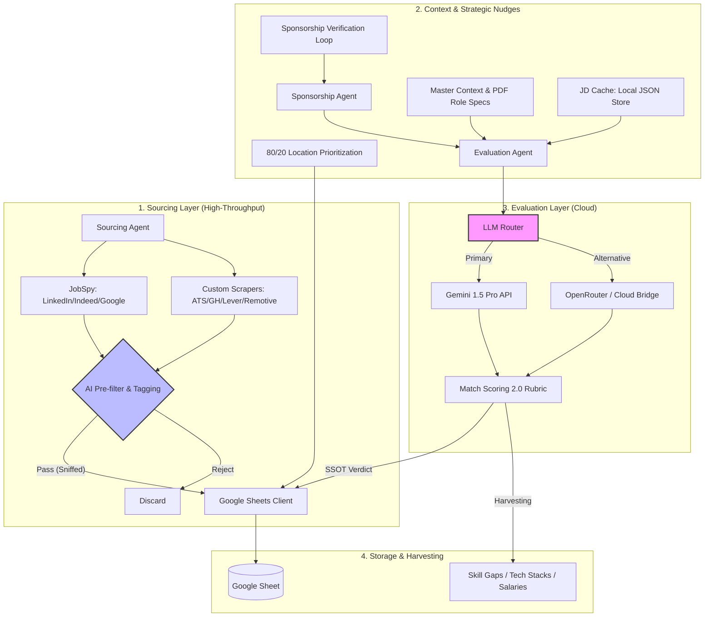

# Job Automation Pipeline

An automated system for sourcing, filtering, and evaluating job postings using **Gemini 1.5 Pro** and **OpenRouter (Unified Cloud)**.

## Master Architecture


## Features
- **Target-Driven Interleaved Pipeline**: Restructured to source and evaluate in 10/10 batches, providing immediate results and exiting once 50 "Must Apply" matches are found.
- **Dual-Model Strategy**:
    - **Sourcing/Sniffing**: Powered by `gemini-2.5-flash-lite` for ultra-low-cost relevance checks.
    - **Deep Matching**: Powered by `gemini-2.0-flash` for high-fidelity evaluation and scoring.
- **Unified Cloud Bridge**: One API key (OpenRouter) to access any model (Claude, DeepSeek, Gemini).
- **AI-Enhanced Sourcing**: 
    - **Smart Sniffing**: Drops irrelevant roles before they hit the sheet.
    - **Query Expansion**: Brainstorms search terms for better coverage.
- **Cloud-Powered Performance**: Deep evaluation with robust 429 rate limit resilience.

## Project Structure
- `src/agents/`: Business logic (Sourcing, Evaluation).
- `src/core/`: Shared clients (Sheets, `LLMRouter`, Config).
- `src/scrapers/`: Individual job site scrapers.
- `src/prompts/`: LLM System Prompts.
- `scripts/`: Utility scripts categorized into `diagnostics/`, `tools/`, and `legacy/`.
- `config/`: Credentials, `pipeline.yaml`, and local JD cache.
- `data/`: Profiles, Master Context, and harvested insights.

## Usage
Run the full pipeline:
```bash
python3 run_pipeline.py
```
For detailed agent instructions, see [.agent/workflows/job_pipeline.md](.agent/workflows/job_pipeline.md).

## Configuration
- **Environment**: Copy `.env.example` to `.env`. Required: `OPENROUTER_API_KEY`, `GEMINI_API_KEY` (fallback).
- **Pipeline**: Edit `config/pipeline.yaml` to change:
    - `sourcing`: Queries, `expand_ai_queries`, `use_ai_filter`.
    - `evaluation`: `provider` (openrouter/gemini), `gemini_model`, `openrouter_model`.

## Job descriptions (JD)
- **Local cache**: Full JDs are stored in `config/jd_cache.json` (keyed by canonical URL) to avoid cluttering Google Sheets while keeping evaluation context high.

## Sorting & Verdicts
- **SSOT**: Sorting logic is centralized around a 0-100 "Apply Conviction Score". High scores (🔥/✅) are sorted to the top automatically.
