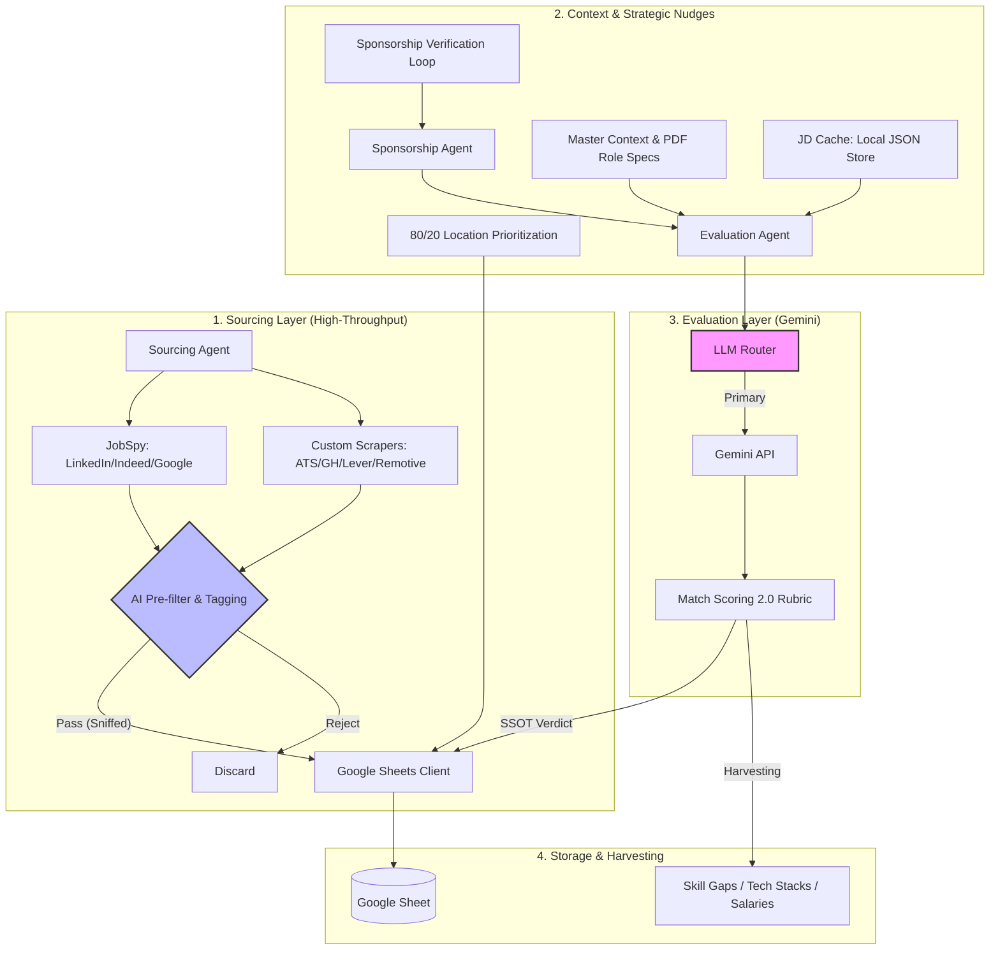

# Job Automation Pipeline

An automated system for sourcing, filtering, and evaluating job postings using **Gemini 1.5 Pro** and **Gemini 2.5 Flash**.

## Master Architecture

```mermaid
graph TD
    subgraph Sourcing ["1. Sourcing Layer (High-Throughput)"]
        A[Sourcing Agent] --> B[JobSpy: LinkedIn/Indeed/Google]
        A --> C[Custom Scrapers: ATS/GH/Lever/Remotive]
        B & C --> D{AI Pre-filter & Tagging}
        D -- "Pass (Sniffed)" --> E[Google Sheets Client]
        D -- Reject --> F[Discard]
    end

    subgraph Intelligence ["2. Context & Strategic Nudges"]
        H[80/20 Location Prioritization] --> E
        I[Sponsorship Verification Loop] --> J
        K[Master Context & PDF Role Specs] --> G
        L[JD Cache: Local JSON Store] --> G
    end

    subgraph Logic ["3. Evaluation Layer (Gemini)"]
        G[Evaluation Agent] --> M[LLM Router]
        M -- Primary --> N[Gemini API]
        N --> Q[Match Scoring 2.0 Rubric]
        J[Sponsorship Agent] --> G
    end

    subgraph Data ["4. Storage & Harvesting"]
        E --> R[(Google Sheet)]
        Q -- SSOT Verdict --> E
        Q -- Harvesting --> S[Skill Gaps / Tech Stacks / Salaries]
    end

    style M fill:#f9f,stroke:#333,stroke-width:2px
    style D fill:#bbf,stroke:#333,stroke-width:2px
```

## Features
- **Target-Driven Interleaved Pipeline**: Restructured to source and evaluate in 10/10 batches, providing immediate results and exiting once 50 "Must Apply" matches are found.
- **Dual-Model Strategy**:
    - **Sourcing/Sniffing**: Powered by `gemini-2.5-flash-lite` for ultra-low-cost relevance checks.
    - **Deep Matching**: Powered by `gemini-2.0-flash` for high-fidelity evaluation and scoring.

- **AI-Enhanced Sourcing**: 
    - **Smart Sniffing**: Drops irrelevant roles before they hit the sheet.
    - **Query Expansion**: Brainstorms search terms for better coverage.
- **Cloud-Powered Performance**: Deep evaluation with robust 429 rate limit resilience.

- **Full-cycle learning (optional)**:
    - **Post-LLM calibration**: Learned patterns in `data/learned_patterns.yaml` adjust scores (bounded), with `Calibration Delta`, `Base LLM Score`, and `Decision Audit JSON` on the sheet.
    - **Feedback**: Set `Feedback` / `Feedback Note` on rows, then run `apps/cli/scripts/tools/ingest_feedback.py` to merge into learned patterns (or enable `cycle.run_feedback_ingest` in `config/pipeline.yaml`).
    - **Daily digest**: After a run, digest files are written under `data/digests/` (see `digest.*` in `config/pipeline.yaml`). `cycle.run_digest_after_pipeline` runs digest generation and can mark `Digest Status` / `Action Link` on the sheet.

- **Automation guardrails**: `cycle.automation_hooks_enabled` is reserved for future hooks; it does **not** auto-apply to jobs—manual approval remains required.

## Project Structure
- `apps/cli/run_pipeline.py`: Main daily pipeline entrypoint.
- `apps/cli/legacy/agents/`: Evaluation and legacy orchestration agents.
- `apps/cli/legacy/core/`: Shared clients (`GoogleSheetsClient`, `LLMRouter`, config, filters).
- `apps/cli/legacy/scrapers/`: Individual job site scrapers.
- `apps/cli/legacy/prompts/`: LLM system prompts.
- `apps/cli/scripts/`: Utility scripts categorized into `diagnostics/`, `tools/`, and `legacy/`.
- `config/`: Credentials, `pipeline.yaml`, and local JD cache.
- `data/`: Profiles, Master Context, and harvested insights.

## Usage
Run the full pipeline from the repo root (so `config/pipeline.yaml` resolves):
```bash
cd /path/to/Job_Automation && python3 apps/cli/run_pipeline.py
```
For detailed agent instructions, see [.agent/workflows/job_pipeline.md](.agent/workflows/job_pipeline.md).

## Configuration
- **Environment**: Copy `.env.example` to `.env`. Required: `GEMINI_API_KEY`.
- **Google Sheet URL**: To use an existing workbook (recommended; avoids creating a new file in Drive), set either:
  - `sheet.spreadsheet_id` in `config/pipeline.yaml` (full URL or raw ID), or
  - `GOOGLE_SHEET_ID` in `.env` (same value).
  Precedence: constructor argument → `GOOGLE_SHEET_ID` / `GOOGLE_SHEETS_SPREADSHEET_ID` → `pipeline.yaml`. Share the sheet with the service account from `config/credentials.json` as **Editor**.
- **User profile context (required)**: Evaluation is grounded in your `master_context.yaml` and will fail fast if the compiled profile is missing or stale.
  - Ensure `data/profiles/master_context.yaml` exists.
  - Build/update the compiled context:

```bash
cd /path/to/Job_Automation && python3 apps/cli/scripts/tools/build_dense_matrix.py
```
- **Pipeline**: Edit `config/pipeline.yaml` to change:
    - `sourcing`: Queries, `expand_ai_queries`, `use_ai_filter`, `jobspy_sites`.
    - `sourcing.use_ai_filter`: When `true`, runs an extra LLM “sniffer” after static filters (more cost; use when scrapers return noisy titles). Default is `false` for higher sheet yield.
    - `sourcing.jobspy_sites`: Sites passed to JobSpy (default omits Glassdoor because it often errors on location).
    - `filters`: Static rules (`inclusions`, `seniority_exclusions`, `seniority_soft_exclusions` + `seniority_soft_bypass_substrings`, locations). Each sourcing batch logs a **Sourcing filter summary** with reject counts by reason.
    - `evaluation`: `provider` (gemini), `gemini_model`.
    - `learning`: Enable/disable calibration, `max_abs_delta`, `patterns_path`.
    - `digest`: `top_n`, `output_dir`.
    - `cycle`: `run_digest_after_pipeline`, `run_feedback_ingest`, `automation_hooks_enabled`.

### Manual tools
```bash
# Merge sheet Feedback into data/learned_patterns.yaml and append data/feedback_events.jsonl
cd /path/to/Job_Automation && python3 apps/cli/scripts/tools/ingest_feedback.py

# Build today's digest (JSON + Markdown); optionally update sheet columns
cd /path/to/Job_Automation && python3 apps/cli/scripts/tools/build_job_digest.py --update-sheet

# Build career strategy (roles + sectors + upskilling) from recent evaluation signals
cd /path/to/Job_Automation && python3 apps/cli/scripts/tools/build_career_strategy.py
```

## Job descriptions (JD)
- **Local cache**: Full JDs are stored in `config/jd_cache.json` (keyed by canonical URL) to avoid cluttering Google Sheets while keeping evaluation context high.
- **Selector-only verification**: Evaluation only runs when the JD was extracted from known JD containers/selectors (e.g. `.job-description`, `#job-description`). Rows with `Status=NO_JD` are not evaluated.
- **Evidence-first decisions**: For evaluated rows, `Evidence JSON` contains the score breakdown and JD/profile evidence so you can audit why a verdict was given.

## Product contract & SSOT
- **Product Contract**: See `docs/PRODUCT_CONTRACT.md` for mission, purpose, and hard boundaries (no fabrication, no eval without verified JD/profile, auditability).
- **Cycle SSOT**: See `docs/CYCLE_SSOT.md` for the living Mermaid flow and preflight checklist. Regenerate it after architecture changes with:

```bash
cd /path/to/Job_Automation && python3 apps/cli/scripts/tools/generate_cycle_ssot.py
```

## Sorting & Verdicts
- **SSOT**: Sorting logic is centralized around a 0-100 "Apply Conviction Score". High scores (🔥/✅) are sorted to the top automatically.
