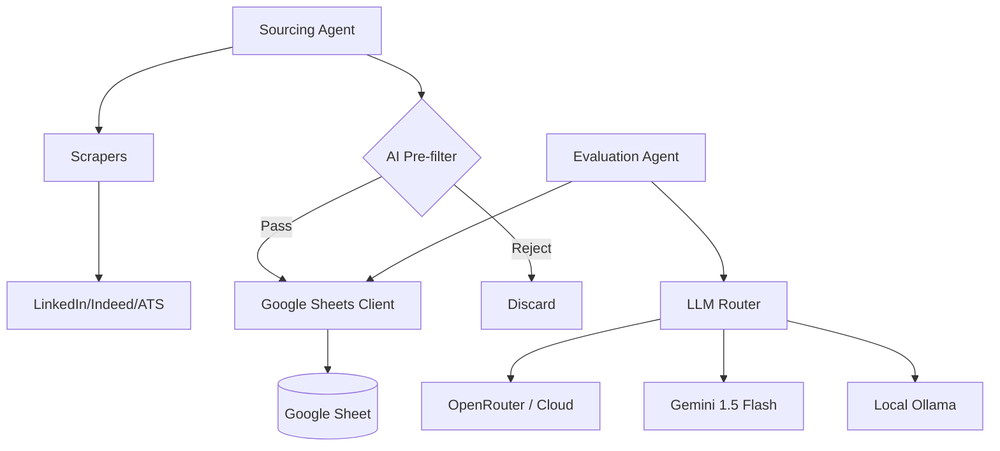

# Job Automation Pipeline

An automated system for sourcing, filtering, and evaluating job postings using **OpenRouter (Unified Cloud)**, Gemini, and local LLMs (Ollama).

## Architecture


## Features
- **Unified Cloud Bridge**: One API key (OpenRouter) to access any model (Claude, DeepSeek, Gemini).
- **AI-Enhanced Sourcing**: 
    - **Smart Sniffing**: Drops irrelevant roles before they hit the sheet.
    - **Query Expansion**: Brainstorms search terms for better coverage.
    - **Dynamic Tagging**: Auto-tags jobs with Style, Seniority, and Industry.
- **Tiered Resilience**: Hybrid architecture with automated fallback (OpenRouter -> Gemini -> local Ollama).

## Project Structure
- `src/core/`: Shared clients (Sheets, `LLMRouter`).
- `src/scrapers/`: Individual job site scrapers.
- `src/agents/`: Business logic (Sourcing, Evaluation, Sponsorship).
- `src/prompts/`: LLM System Prompts.
- `config/`: Credentials and local configuration.

## Usage
Run the full pipeline:
```bash
python3 run_pipeline.py
```
For detailed agent instructions, see [.agent/workflows/job_pipeline.md](.agent/workflows/job_pipeline.md).

## Configuration
- **Environment**: Copy `.env.example` to `.env`. Required: `OPENROUTER_API_KEY`, `GEMINI_API_KEY` (fallback).
- **Pipeline**: Edit `config/pipeline.yaml` to change:
    - `sourcing`: Queries, `expand_ai_queries`, `use_ai_filter`.
    - `evaluation`: `provider` (hybrid/openrouter/gemini/ollama), `openrouter_model`.

## Job descriptions (JD)
- **Local cache**: Full JDs are stored in `config/jd_cache.json` (keyed by canonical URL) to avoid cluttering Google Sheets while keeping evaluation context high.

## Sorting & Verdicts
- **SSOT**: Sorting logic is centralized around a 0-100 "Apply Conviction Score". High scores (🔥/✅) are sorted to the top automatically.
