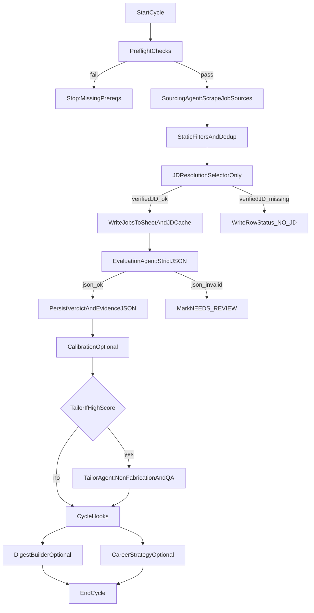

# Cycle SSOT (Living)

This is the living, high-level description of the end-to-end cycle.

- **Why this exists**: this doc is the “language” of the product — it should match how the system actually behaves.
- **How it stays current**: the Mermaid diagram + checklist are generated by `apps/cli/scripts/tools/generate_cycle_ssot.py`.

## Key principles (from Product Contract)
- No evaluation without verified JD
- No evaluation without compiled user context
- Evidence JSON required for every verdict

## Generated (do not edit by hand)
<!-- SSOT:BEGIN -->
_Last generated: 2026-04-08 01:18:52_

### Preflight checklist
- LLM key present for `evaluation.provider` (`OPENROUTER_API_KEY`, `GEMINI_API_KEY`, or `OPENAI_API_KEY`)
- `config/credentials.json` present (Sheets)
- Profile present + compiled:
  - `master_context.yaml` exists
  - `dense_master_matrix.json` exists and is fresh

### Hard gates
- Evaluate only if `JD Verified = Y` (selector-only extraction)
- If model output invalid: set `Status = NEEDS_REVIEW` and store raw/error in `Evidence JSON`
<!-- SSOT:END -->

