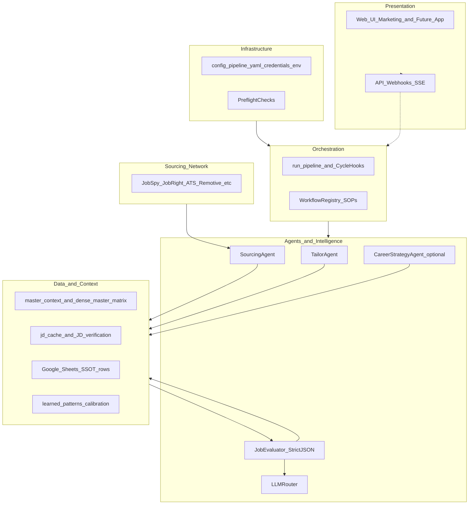
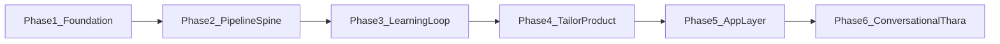

# Layers, phases, and the SSOT trio

This document ties together three sources of truth so engineering, ops, and product stay aligned:

| Document | Purpose |
|----------|---------|
| [PRODUCT_CONTRACT.md](PRODUCT_CONTRACT.md) | Non-negotiable boundaries (no fabrication, no eval without verified JD + compiled context, auditability). |
| [CYCLE_SSOT.md](CYCLE_SSOT.md) | Authoritative per-job lifecycle diagram (regenerate with `python apps/cli/scripts/tools/generate_cycle_ssot.py` after pipeline changes). |
| This file | Layer stack + build phases + where code lives. |

## Layer model

## Build phases (dependency order)

- **Phase 1–2:** Contract + hardened CLI pipeline ([`apps/cli/run_pipeline.py`](../apps/cli/run_pipeline.py)).
- **Phase 3:** Cycle hooks and calibration ([`docs/CYCLE_HOOKS.md`](CYCLE_HOOKS.md)).
- **Phase 4:** Tailor + QA ([`docs/TAILOR_QA_CHECKLIST.md`](TAILOR_QA_CHECKLIST.md)).
- **Phase 5:** API + app shell ([`apps/api/README.md`](../apps/api/README.md), [`website_ui/`](../website_ui/)).
- **Phase 6:** Roadmap ([`docs/ROADMAP_THARA_ADVANCED.md`](ROADMAP_THARA_ADVANCED.md)).

## Canonical imports

Production pipeline code lives under **`apps/cli/legacy/`** and **`core_agents/`**. The older **`src/`** tree remains for legacy scripts and tests; see [CANONICAL_IMPORTS.md](CANONICAL_IMPORTS.md).
