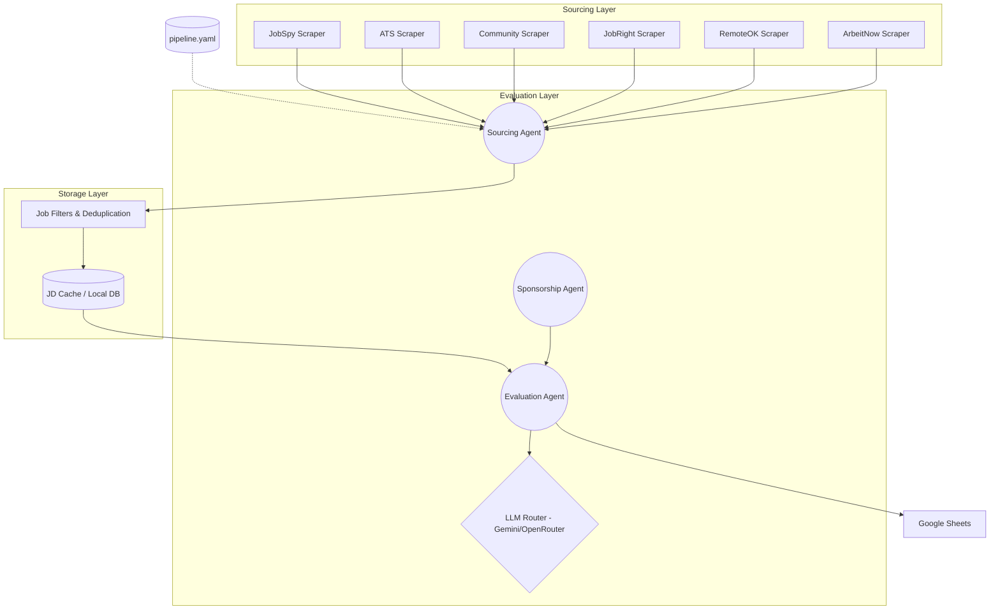

# System Architecture

This document describes the high-level architecture of the Job Search Automation pipeline. The pipeline is designed around a 4-layer architecture: Sourcing, Storage, Evaluation, and Output.

## Core Layers

### 1. Sourcing Layer
The sourcing layer is responsible for aggregating job listings from disparate sources. It uses active scrapers (e.g., JobSpy) and ATS-specific scrapers (e.g., Greenhouse, Ashby, Lever). Configuration for active queries and limits is handled in `config/pipeline.yaml`.

### 2. Storage & Deduplication Layer
Handles storing fetched jobs, detecting duplicates using URL normalization, and managing the local JD Cache (`data/jd_cache.json`).

### 3. Evaluation Layer
The "Brain" of the pipeline. Job Descriptions (JDs) are passed to an LLM `evaluate_jobs.py` which uses contextual profiles (e.g., Master Context, Role Specializations) to perform "Deep Matching" and calculate an Apply Conviction Score.

### 4. Output Layer
The final results are exported. Job data is batched and streamed directly to a Google Sheet (`google_sheets_client.py`).

## Architecture Diagram



---

## Dynamic Architecture Generator

As the pipeline evolves, this static diagram may become outdated. You can dynamically generate an updated architecture diagram by running the included python utility:

```bash
python scripts/tools/generate_architecture.py
```

This script will read the active scrapers, agents, and configuration, and output a fresh Mermaid diagram directly to the terminal, which you can paste here or view in any Markdown renderer.
